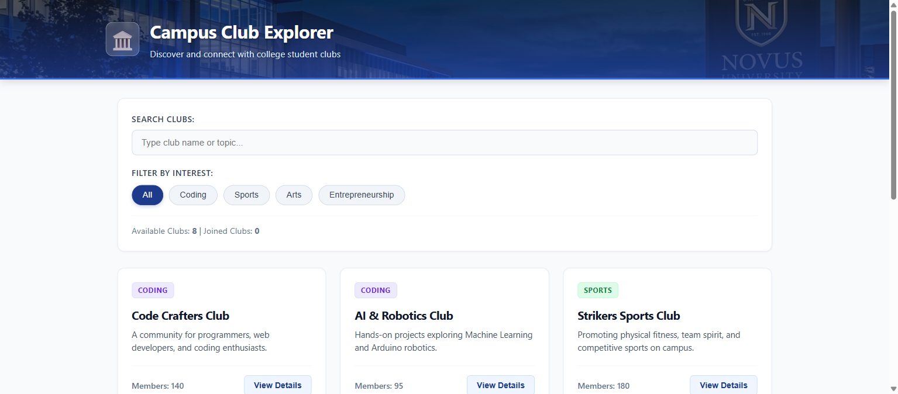

# 🏛️ Campus Club Explorer

An interactive, responsive single-page web application built with **React 18** and **Vite** for discovering, exploring, and managing college campus clubs.



---

## 🌟 Key Features

- **Club Discovery**: Browse college clubs across Coding, Sports, Arts, and Entrepreneurship domains.
- **Dynamic Search & Filtering**: Real-time keyword search combined with instant category pill filtering with zero page reloads.
- **Interactive Details Modal**: Pop-up dialog displaying meeting times, faculty advisors, member counts, and active activities.
- **Membership Tracking**: Join or leave clubs with immediate member count updates, card badges, and real-time toast notifications.
- **Responsive & Accessible UI**: Solid-color design with smooth hover elevations, text contrast, and CSS Grid layout.

---

## 🧠 Core React Concepts Covered

1. **Props**: Unidirectional data flow from parent `App.jsx` to presentational child components (`ClubCard`, `ClubModal`, `SearchFilter`).
2. **Lists & Keys**: Traversal of arrays with `.map()` using stable `key={club.id}` for optimal Virtual DOM reconciliation.
3. **Controlled Inputs & Search/Filter UI**: Synchronized form state with `useState` and multi-predicate `.filter()`.
4. **Conditional Rendering**: Empty states, popup alerts, membership tags, and modal dialogs.
5. **Component Reuse**: A single `<ClubCard />` component reused dynamically across all clubs.

---

## 📁 Project Structure

```text
├── public/
│   └── campus_header_bg.jpg      # Header background banner
├── src/
│   ├── components/
│   │   ├── ClubCard.jsx          # Reusable card component
│   │   ├── ClubModal.jsx         # Details modal dialog
│   │   ├── Navbar.jsx            # Top navigation header
│   │   └── SearchFilter.jsx      # Search input & category pills
│   ├── data/
│   │   └── clubsData.js          # Mock data
│   ├── App.jsx                   # Central state & application layout
│   ├── App.css                   # Solid-color responsive stylesheet
│   ├── ClubsData.js              # Root clubs data export
│   ├── index.css                 # CSS reset
│   └── main.jsx                  # React DOM entry point
├── Campus_Club_Explorer_Report.pdf              # Academic report
├── Campus_Club_Explorer_Final_Presentation.pptx # 6-Slide presentation deck
├── PROJECT_REPORT.md             # Detailed markdown report
└── PRESENTATION_SLIDES.md        # Slides & speaker notes
```

---

## 🚀 Getting Started

### Prerequisites
- Node.js (v18 or higher)
- npm or yarn

### Installation
```bash
# Clone the repository
git clone https://github.com/aasish3187/Campus-Club-Explorer.git

# Navigate into project directory
cd Campus-Club-Explorer

# Install dependencies
npm install

# Start the local development server
npm run dev
```

Open your browser and navigate to `http://localhost:5173`.

### Production Build
```bash
npm run build
```

---

## 📄 Documentation & Presentation
- **Project Report (PDF):** [`Campus_Club_Explorer_Report.pdf`](./Campus_Club_Explorer_Report.pdf)
- **PowerPoint Presentation:** [`Campus_Club_Explorer_Final_Presentation.pptx`](./Campus_Club_Explorer_Final_Presentation.pptx)
- **Viva Guide:** [`EXPLANATION_GUIDE.md`](./EXPLANATION_GUIDE.md)
