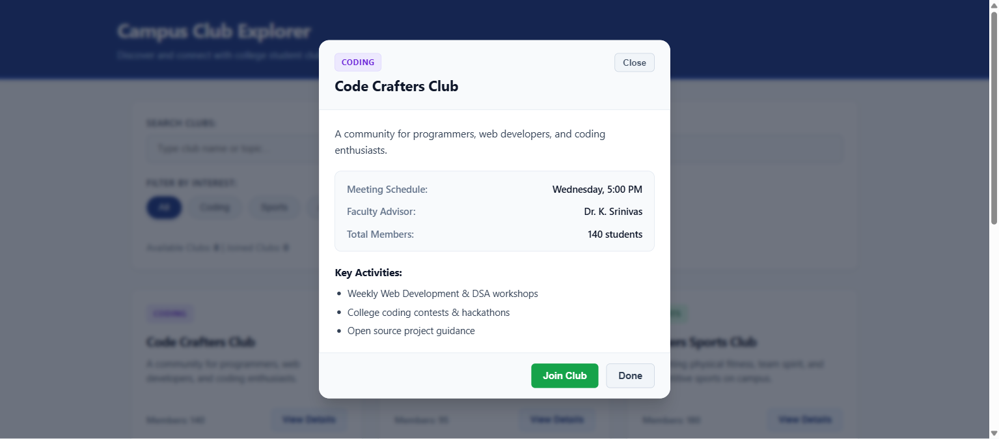
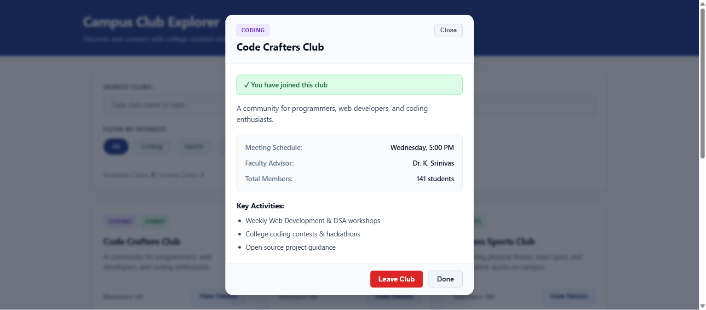

# 🏛️ Campus Club Explorer • Vignan University

[](https://campus-club-explorer.bytexl.live/)
[](https://react.dev/)
[](https://vitejs.dev/)
[](https://bytexl.app/)
[-1e3a8a?style=for-the-badge)](https://www.vignan.ac.in/)

An interactive, responsive single-page web application built with **React** and **Vite** for students of **Vignan's Foundation for Science, Technology & Research (VFSTR)** to discover, explore, and join campus clubs and organizations.

🔗 **Live Deployment:** [https://campus-club-explorer.bytexl.live/](https://campus-club-explorer.bytexl.live/)

---

## 📸 Application Previews

### 1. Main Dashboard & Club Catalog


### 2. Interactive Club Details Modal & Activities


### 3. Real-Time Membership Registration & Status


---

## 🌟 Key Features

- 🏛️ **Vignan Campus Themed Header:** Features authentic campus architecture of Vignan University with clean typography and an institutional emblem (`🏛️`).
- 🔍 **Real-Time Multi-Predicate Search:** Instantly filter clubs by name, description, or keyword with zero page reloads.
- 🏷️ **Category Filtering:** One-click filter pills for **Coding**, **Sports**, **Arts**, and **Entrepreneurship**.
- 📋 **Interactive Details Modal:** Pop-up dialog showcasing faculty advisors, meeting schedules, member counts, and bulleted key activities.
- 👥 **Live Membership Tracking:** Instant Join / Leave toggle with state persistence across views, a live member counter increment, and active membership badges.
- 🔔 **Toast Notification System:** Dynamic popup alerts confirming club registration or exit with automatic dismiss timer.
- 📱 **Mobile-Responsive CSS Grid:** Built using clean, modern CSS with responsive auto-fill cards and subtle hover micro-interactions.

---

## 🧠 React Concepts Demonstrated

| Concept | Implementation in Code | Where to Check |
| :--- | :--- | :--- |
| **Props** | Read-only properties passed from `App.jsx` to presentational child components (`club`, `isJoined`, `onViewDetails`). | `src/components/ClubCard.jsx`, `ClubModal.jsx` |
| **Lists & Keys** | Traversal of collections using `.map()` with stable unique identifier keys (`key={club.id}`) for efficient DOM reconciliation. | `src/App.jsx`, `ClubModal.jsx`, `SearchFilter.jsx` |
| **Controlled Forms** | Real-time input synchronization via React `useState` (`searchQuery` and `selectedCategory`). | `src/components/SearchFilter.jsx` |
| **Conditional Rendering** | Dynamic UI states including empty search results, modal backdrop visibility, and "Joined" badges using ternary and logical `&&` operators. | `src/App.jsx`, `ClubCard.jsx`, `ClubModal.jsx` |
| **Component Reusability** | A single modular `<ClubCard />` component reused dynamically across multiple club domains. | `src/components/ClubCard.jsx` |

---

## 📁 Project Architecture & Clean Folder Structure

```text
Campus-Club-Explorer/
├── docs/
│   ├── Campus_Club_Explorer_Report.pdf        # Complete Academic Project Report (PDF)
│   ├── Campus_Club_Explorer_Presentation.pptx # 6-Slide Executive Presentation (PPTX)
│   ├── EXPLANATION_GUIDE.md                   # Viva & Oral Evaluation Q&A Cheatsheet
│   ├── PROJECT_REPORT.md                      # Markdown Project Documentation
│   ├── PRESENTATION_SLIDES.md                 # Slide Deck Outline & Speaker Notes
│   └── screenshots/
│       ├── home.png                           # Main catalog UI screenshot
│       ├── modal.png                          # Club details modal screenshot
│       ├── joined.png                         # Membership toast & badge screenshot
│       └── card.png                           # Individual card screenshot
├── public/
│   ├── vignan_campus_right.jpg                # Vignan University header banner
│   └── favicon.svg                            # Application favicon
├── src/
│   ├── components/
│   │   ├── ClubCard.jsx                       # Reusable club card component
│   │   ├── ClubModal.jsx                      # Details modal pop-up dialog
│   │   ├── Navbar.jsx                         # Institutional header banner
│   │   └── SearchFilter.jsx                   # Search input & category filter pills
│   ├── App.css                                # Clean responsive stylesheet
│   ├── App.jsx                                # Central state & application layout
│   ├── ClubsData.js                           # Mock dataset of university clubs
│   ├── index.css                              # Baseline typography & CSS reset
│   └── main.jsx                               # React DOM root mounting
├── index.html                                 # Single-page HTML shell
├── package.json                               # Dependencies and build scripts
└── vite.config.js                             # Vite configuration
```

---

## 📑 Academic Documentation & Presentation

All formal academic deliverables for project evaluation and viva defense are available in the [`docs/`](./docs/) directory:

- 📄 **[Download Academic Report (PDF)](./docs/Campus_Club_Explorer_Report.pdf):** Complete report including requirements analysis, functional specifications, test cases, and viva prep.
- 📊 **[Download Presentation Deck (PPTX)](./docs/Campus_Club_Explorer_Presentation.pptx):** High-impact 6-slide PowerPoint presentation with real UI screenshots and complete slide-by-slide speaker notes.
- 💡 **[Viva Defense Cheat Sheet](./docs/EXPLANATION_GUIDE.md):** Plain English answers to standard faculty evaluation questions on Props, State, Keys, and Virtual DOM.

---

## 🛠️ Local Development Setup

### Prerequisites
- [Node.js](https://nodejs.org/) (v18 or higher recommended)
- `npm` or `yarn`

### Installation & Run

1. **Clone the repository:**
   ```bash
   git clone https://github.com/aasish3187/Campus-Club-Explorer.git
   cd Campus-Club-Explorer
   ```

2. **Install dependencies:**
   ```bash
   npm install
   ```

3. **Start the local development server:**
   ```bash
   npm run dev
   ```

4. **Open in browser:**
   ```text
   http://localhost:5173/
   ```

5. **Build for production:**
   ```bash
   npm run build
   ```

---

## 🌐 Deployment Details

- **Live URL:** [https://campus-club-explorer.bytexl.live/](https://campus-club-explorer.bytexl.live/)
- **Hosting Environment:** ByteXL Cloud Containers
- **Bundler:** Vite 8 (ESModules production build)
- **Institution:** Vignan's Foundation for Science, Technology & Research (VFSTR)
